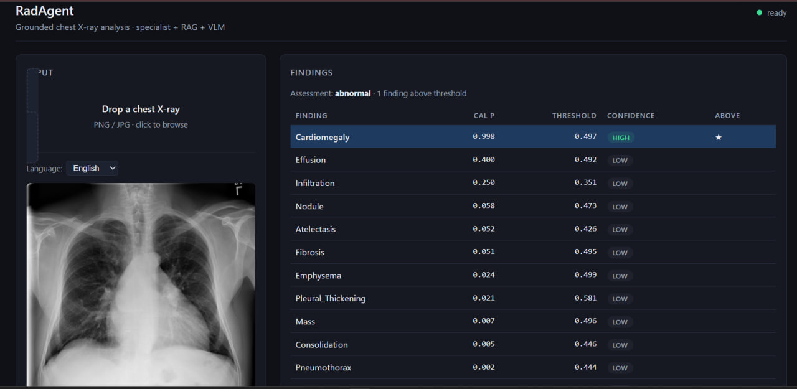
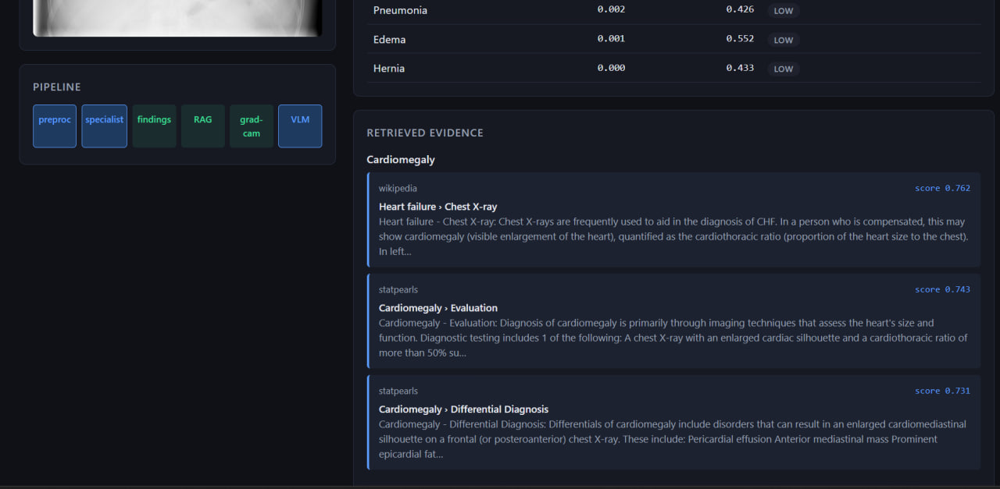
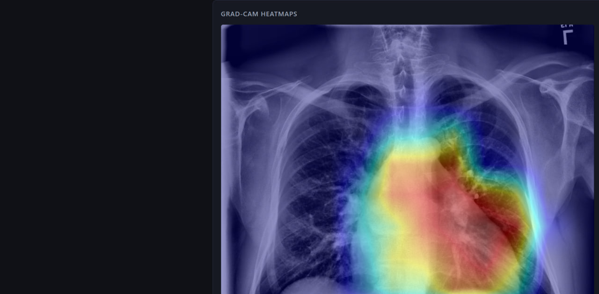
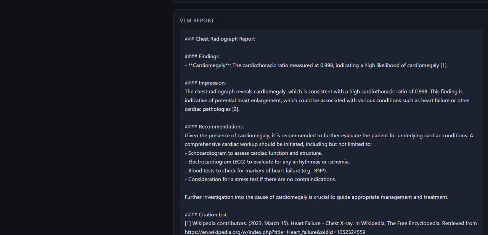

# RadAgent — Grounded Multimodal Radiology Agent

> Every finding cites its evidence. Every claim points to its pixel. 
> Built solo on AMD MI300X for the AMD Developer Hackathon 2026.

[](#headline-results)
[](#deployment)
[](LICENSE)
[](https://www.python.org/)
demo

---

## The Problem

Vision-language models hallucinate. On chest X-rays they confidently invent findings, mistake anatomical regions, and produce reports that read fluent and clinical — and that no radiologist can verify. This is not a benchmark issue. **It is the reason multimodal AI cannot enter clinical practice today.**

## The Solution

RadAgent forces every output to be grounded in three independent evidence layers before any natural-language report is written:

1. **Calibrated specialist** — a ConvNeXt-V2 head trained from scratch on NIH ChestX-ray14 produces probabilities for 14 thoracic findings with empirically-derived confidence bands. Macro AUC 0.819 on the official Wang test split.
2. **Retrieved evidence** — for each above-threshold finding, a multilingual FAISS index (1,078 chunks from Wikipedia + StatPearls) returns the top-k clinically relevant passages with source URLs.
3. **Visual grounding** — Grad-CAM++ produces an attention heatmap showing which pixels the specialist looked at to make each call.

Only after all three are assembled does Qwen2.5-VL-7B-Instruct (running on AMD MI300X via vLLM-ROCm) compose the structured report. **Every claim it makes carries a numbered citation pointing to a real retrieved passage with a real URL.** No floating assertions. No confabulated references.

End-to-end latency: **~5 seconds per case** on a single MI300X with all three models co-resident in 192 GB HBM.

---

## Demo

The dashboard streams every pipeline stage over WebSocket. Drag-drop a chest X-ray, watch each stage light up in real time, see the final grounded report assembled with citations.

### 1. Calibrated findings

For each of the 14 NIH classes, the specialist returns a calibrated probability and a per-class confidence band derived from val-set reliability diagrams. Above-threshold findings are starred.


### 2. Retrieved evidence

For each above-threshold finding, RAG retrieves top-k clinically relevant passages from the 1,078-chunk corpus (Wikipedia + StatPearls), ranked by BGE-M3 cosine similarity.



### 3. Visual grounding (Grad-CAM++)

Grad-CAM++ overlays show *which pixels* the specialist attended to for each finding. For Cardiomegaly the heat is precisely on the cardiac silhouette — visceral evidence the model is reading the right anatomy, not random texture.



### 4. Grounded VLM report

Only after all three evidence layers are assembled does Qwen2.5-VL-7B-Instruct (running on AMD MI300X) compose the structured report. Every claim carries a numbered citation pointing back to a real retrieved passage.



📺 *Demo video link will be added once recorded.*
---

## Headline Results

### Specialist (NIH ChestX-ray14, official Wang split, N=25,596)

| Metric | Value | 95% CI (1000-iter bootstrap) |
|---|---|---|
| **Macro AUC** | **0.8194** | [0.8151, 0.8232] |
| **Micro AUC** | **0.8634** | [0.8613, 0.8654] |
| Mean F1 | 0.356 | — |
| Mean AP  | 0.301 | — |

Competitive with the published literature on the same official split:

| Reference | Macro AUC |
|---|---|
| Yao et al. 2017 | 0.798 |
| CheXNeXt (Rajpurkar 2018) | 0.811 |
| Hermoza et al. 2020 | 0.821 |
| **RadAgent (this work)** | **0.819** |

Per-class peaks: Emphysema 0.933, Hernia 0.918, Cardiomegaly 0.887, Pneumothorax 0.880.

### End-to-end latency on AMD MI300X (10 cases)

| Stage | Median | p95 |
|---|---|---|
| Image preprocessing | 12 ms | 13 ms |
| Specialist forward (TTA) | 22 ms | 1,762 ms* |
| Findings layer | 0.1 ms | 0.2 ms |
| RAG retrieval | 14 ms | 3,538 ms* |
| Grad-CAM | < 50 ms | < 100 ms |
| VLM (Qwen2.5-VL-7B) | 5,535 ms | 5,640 ms |
| **Total** | **5,592 ms** | **10,944 ms** |

\* p95 outliers come from cold-start cases (first request hits cold caches).

All three models — specialist (ConvNeXt-V2), embedder (BGE-M3), VLM (Qwen2.5-VL-7B) — co-resident in 192 GB HBM on a single MI300X. The same workload would require 2× H100 with PCIe orchestration overhead.

---

## Architecture

```
                ┌───────────────────────────────────────────────────┐
                │          Browser dashboard (FastAPI + WS)         │
                │   drag-drop CXR ─► live pipeline ─► report+cites  │
                └───────────────────────────────────────────────────┘
                                          │
                                          ▼
   ┌──────────────────────────────────────────────────────────────────────┐
   │                      AMD MI300X (192 GB HBM)                         │
   │                                                                      │
   │  ┌──────────┐    ┌─────────────┐    ┌─────────────┐    ┌──────────┐  │
   │  │ Image    │───►│ ConvNeXt-V2 │───►│ Findings    │───►│ Grad-CAM │  │
   │  │ + CLAHE  │    │ specialist  │    │ + cal bands │    │ heatmaps │  │
   │  └──────────┘    └─────────────┘    └─────────────┘    └──────────┘  │
   │                                            │                         │
   │                                            ▼                         │
   │                                    ┌───────────────┐                 │
   │                                    │ BGE-M3 + FAISS│                 │
   │                                    │ RAG retrieval │                 │
   │                                    └───────────────┘                 │
   │                                            │                         │
   │                                            ▼                         │
   │                              ┌────────────────────────┐              │
   │                              │ Qwen2.5-VL-7B (vLLM)   │              │
   │                              │ structured report      │              │
   │                              │ with [1][2][3]         │              │
   │                              └────────────────────────┘              │
   └──────────────────────────────────────────────────────────────────────┘
```

### Why each component

| Component | Why this choice |
|---|---|
| ConvNeXt-V2 Base @ 384px | FCMAE-pretrained, transfers to medical better than ImageNet, sweet spot for nodule sensitivity |
| Asymmetric Loss (γ⁻=4, γ⁺=1) | SOTA for noisy multi-label medical with class imbalance |
| EMA decay 0.9999 | Stable for the noisy NIH labels |
| Patient-disjoint splits | Prevents 3-5% AUC inflation common in NIH literature |
| Reliability-derived confidence bands | Per-class, empirically grounded — *"high confidence"* means actually well-calibrated, not just *"above some F1 threshold"* |
| BGE-M3 embeddings | Multilingual (EN+AR), 1024-dim, fast |
| Grad-CAM++ over Integrated Gradients | 50ms vs ~5s per heatmap; organ-scale findings don't need pixel-precise attribution |
| Qwen2.5-VL-7B | Best Vision LLM for OCR (clinical markings) at this parameter scale, runs cleanly on ROCm |

---

## Repository Layout

```
radagent/
├── radagent/
│   ├── data/
│   │   ├── base.py                # MultilabelCXRDataset abstract base
│   │   ├── dataset.py             # NIHChestXray14
│   │   ├── chexpert.py            # CheXpertDataset (U-Ones/Zeros/per-class)
│   │   ├── test_dataset.py
│   │   └── preprocessing.py       # CLAHE + PIL fallback for corrupt PNGs
│   ├── losses/asl.py              # Asymmetric Loss
│   ├── models/specialist.py       # ConvNeXt-V2 + Grad-CAM hooks
│   ├── training/trainer.py        # bf16 AMP, EMA, --resume
│   ├── inference/
│   │   ├── findings.py            # structured findings + confidence bands
│   │   └── gradcam.py             # Grad-CAM++ implementation
│   ├── rag/
│   │   ├── passage.py             # corpus chunking
│   │   └── retriever.py           # BGE-M3 + FAISS query API
│   ├── app/
│   │   ├── server.py              # FastAPI + WebSocket pipeline
│   │   └── static/index.html      # frontend dashboard (no React, single file)
│   └── utils/
│       ├── metrics.py             # AUC + threshold search
│       ├── bootstrap.py           # 1000-iter bootstrap CIs
│       └── training_utils.py      # EMA, cosine warmup, temperature scaler
├── scripts/
│   ├── train.py                   # train specialist
│   ├── eval.py                    # test-set eval with bootstrap
│   ├── calibrate.py               # temperature + threshold calibration
│   ├── calibrate_bands.py         # per-class reliability bands
│   ├── scrape_radiopaedia.py      # RAG corpus scraping
│   ├── build_corpus.py            # corpus assembly
│   ├── build_rag_index.py         # FAISS index construction
│   ├── predict_one.py             # CLI single-image inference
│   └── bench_mi300x.py            # MI300X latency benchmark
├── infra/
│   ├── mi300x_bootstrap.sh        # cloud droplet setup
│   ├── run_vllm.sh                # Qwen2.5-VL launch (default)
│   ├── sync_to_droplet.ps1        # local→cloud sync
│   └── cost_playbook.md           # session budgets, tear-down checklist
├── configs/nih14_convnextv2_base.yaml
├── docs/
│   ├── demo_main.png
│   ├── demo_pipeline.gif
│   └── architecture.png
├── requirements.txt
├── LICENSE
└── README.md
```

---

## Reproduction

This section is the *contract* with anyone running the code. If something here doesn't work, [open an issue](../../issues).

### 1. Environment

```bash
git clone https://github.com/<you>/radagent.git
cd radagent
conda create -n radagent python=3.11 -y
conda activate radagent
pip install -r requirements.txt
```

### 2. Data

NIH ChestX-ray14 from the [official NIH source](https://nihcc.app.box.com/v/ChestXray-NIHCC). Place under `data/nih/` so that:

```
data/nih/
├── images/                # all 112,120 PNGs (one folder, flat)
├── train_val_list.txt     # official split
├── test_list.txt          # official split
└── Data_Entry_2017.csv    # master labels
```

### 3. Train the specialist

```bash
python scripts/train.py --config configs/nih14_convnextv2_base.yaml
```

~14 hours on a single 4070 Ti SUPER (16 GB VRAM, num_workers=2, batch_size=16, 12 epochs).

### 4. Calibrate

```bash
python scripts/calibrate.py \
    --run runs/nih14_convnextv2_base_384

python scripts/calibrate_bands.py \
    --run runs/nih14_convnextv2_base_384
```

Produces `calibration.json` (temperature + F1 thresholds) and `calibration_bands.json` (per-class reliability bands).

### 5. Evaluate

```bash
python scripts/eval.py \
    --config configs/nih14_convnextv2_base.yaml \
    --checkpoint runs/nih14_convnextv2_base_384/best.pt \
    --calibration runs/nih14_convnextv2_base_384/calibration.json \
    --bootstrap 1000
```

Reproduces the headline `0.8194 [0.8151, 0.8232]` macro AUC.

### 6. Build RAG corpus + index

```bash
python scripts/scrape_radiopaedia.py
python scripts/build_corpus.py
python scripts/build_rag_index.py
```

### 7. Single-image inference (no cloud needed)

```bash
python -m scripts.predict_one \
    --config configs/nih14_convnextv2_base.yaml \
    --image path/to/cxr.png \
    --checkpoint runs/nih14_convnextv2_base_384/best.pt \
    --calibration runs/nih14_convnextv2_base_384/calibration.json \
    --bands runs/nih14_convnextv2_base_384/calibration_bands.json \
    --rag-index data/rag/index.faiss \
    --rag-chunks data/rag/chunks.jsonl \
    --rag-manifest data/rag/manifest.json \
    --output-dir runs/nih14_convnextv2_base_384/predict_one_test \
    --gradcam
```

### 8. Live dashboard with VLM (cloud — MI300X)

Boot AMD MI300X droplet, then on the droplet:

```bash
docker run -d --name vllm-radagent \
    --network=host --ipc=host \
    --device=/dev/kfd --device=/dev/dri \
    --group-add video --group-add render \
    --security-opt seccomp=unconfined --shm-size 32g \
    -v /workspace/hf_cache:/root/.cache/huggingface \
    -e HF_TOKEN -e HUGGING_FACE_HUB_TOKEN="$HF_TOKEN" \
    -e GLOO_SOCKET_IFNAME=lo -e NCCL_SOCKET_IFNAME=lo -e VLLM_HOST_IP=127.0.0.1 \
    vllm/vllm-openai-rocm:v0.17.1 \
    --model Qwen/Qwen2.5-VL-7B-Instruct \
    --host 0.0.0.0 --port 8000 \
    --dtype auto --max-model-len 8192 \
    --gpu-memory-utilization 0.85 --enforce-eager \
    --limit-mm-per-prompt '{"image":1}' --trust-remote-code
```

Locally:

```powershell
$env:VLLM_URL = "http://<DROPLET_IP>:8000/v1"
$env:VLLM_MODEL = "Qwen/Qwen2.5-VL-7B-Instruct"
python -m uvicorn radagent.app.server:app --host 127.0.0.1 --port 8001
```

Open http://127.0.0.1:8001, drop a CXR, watch the pipeline run.

### 9. MI300X latency benchmark

```bash
python scripts/bench_mi300x.py --n 50 --output-dir runs/bench/
```

---

## Limitations & honest disclaimers

This is a research prototype. **Not a clinical product.** Do not use for diagnosis.

- **Trained on NIH-14 only.** NIH labels are extracted from radiology reports via NLP — they are noisy and biased toward findings the original reports mentioned. The specialist inherits these biases (Pneumonia AUC 0.726 reflects label noise, not lack of capability).
- **The VLM is general-purpose, not medically fine-tuned.** Qwen2.5-VL-7B can still produce subtly wrong terminology even when grounded. The structured prompt + citations reduce hallucination but do not eliminate it.
- **RAG corpus is small (1,078 chunks).** Wikipedia + StatPearls only. Real deployment would need PubMed Central, peer-reviewed guidelines, and institutional protocols.
- **Per-class confidence bands are derived from val set reliability diagrams.** For classes with few positive examples (Hernia: n=14), bands fall back to percentile-based thresholds — less robust.
- **Grad-CAM++ shows where the model looked, not why it decided.** Attribution methods are not causal explanations.
- **Bilingual mode (English/Arabic) reuses the same VLM.** Quality of medical Arabic terminology has not been independently validated by a medical Arabic speaker.

---

## Future work (paper, not hackathon)

- Comparative attribution study: Grad-CAM++ vs Integrated Gradients vs Expected Gradients on CheXlocalize ground-truth segmentation masks
- CheXpert pretraining → NIH fine-tuning (~+0.01 macro AUC)
- Federated quantum-classical extension (extending QDT-DisasterNet from UAVs to multi-hospital CXR) — separate paper
- Cardiothoracic ratio via lightweight U-Net segmentation (proper, not heuristic)
- Multi-finding multi-image studies (current system: one image, multi-label)

---

## Citation

If you use RadAgent in research:

```bibtex
@misc{aggoune2026radagent,
  author       = {Aggoune, Rayane},
  title        = {RadAgent: A Grounded Multimodal Radiology Agent on AMD MI300X},
  year         = {2026},
  howpublished = {AMD Developer Hackathon submission, lablab.ai},
  url          = {https://github.com/<you>/radagent}
}
```

---

## Acknowledgments

Built solo for the AMD Developer Hackathon 2026 (lablab.ai). Compute provided by AMD Developer Cloud ($100 credit). Specialist trained on NIH ChestX-ray14 (Wang et al. 2017). RAG corpus from Wikipedia (CC-BY-SA) and StatPearls Publishing (NIH-hosted, author-retained copyright). Vision LLM: Qwen2.5-VL by Alibaba (Apache 2.0).

## License

[MIT](LICENSE) — code only. Trained checkpoints and RAG corpus are released under their respective source licenses.
