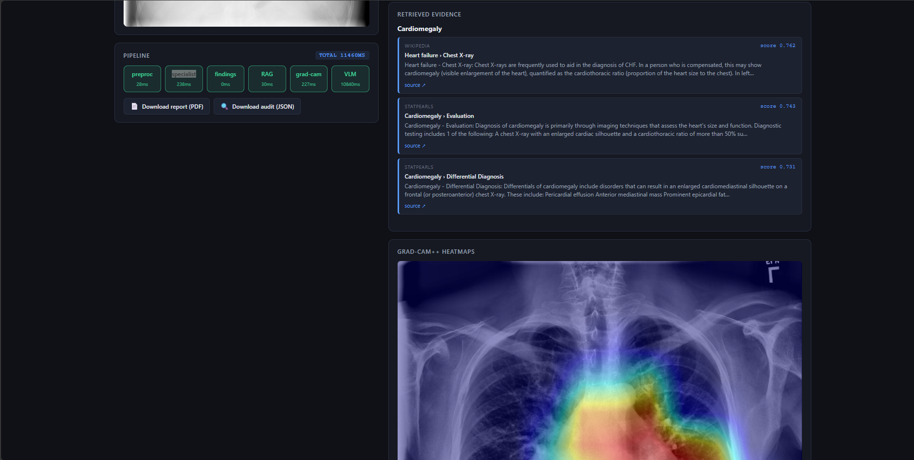
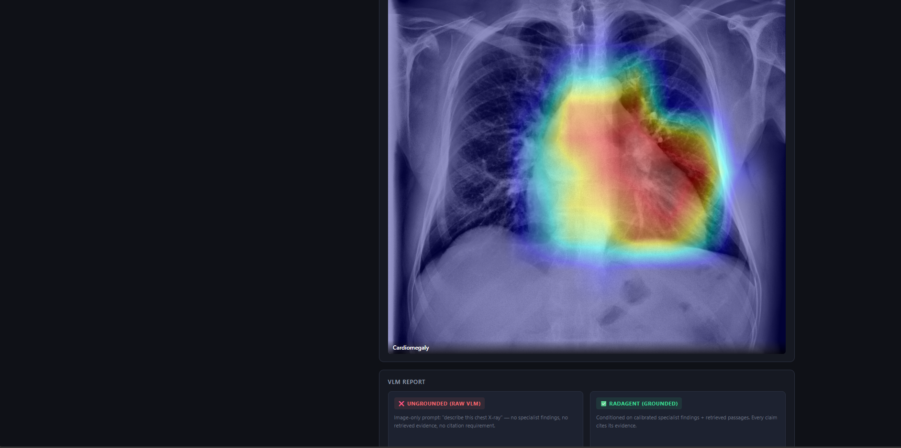
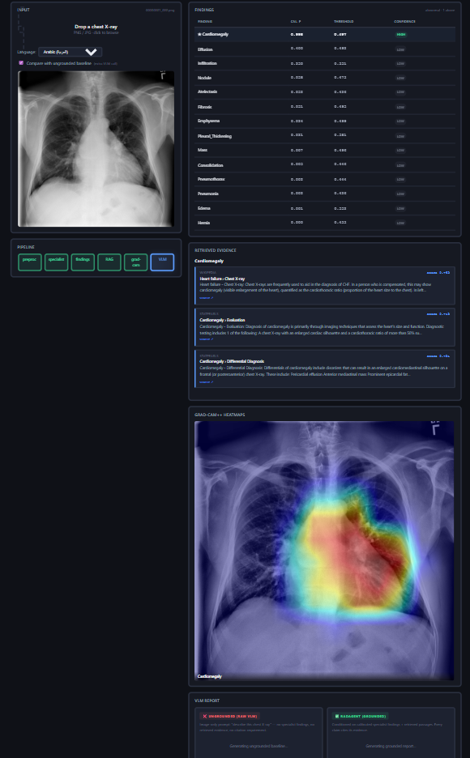
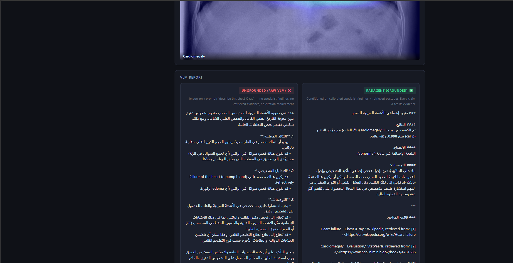
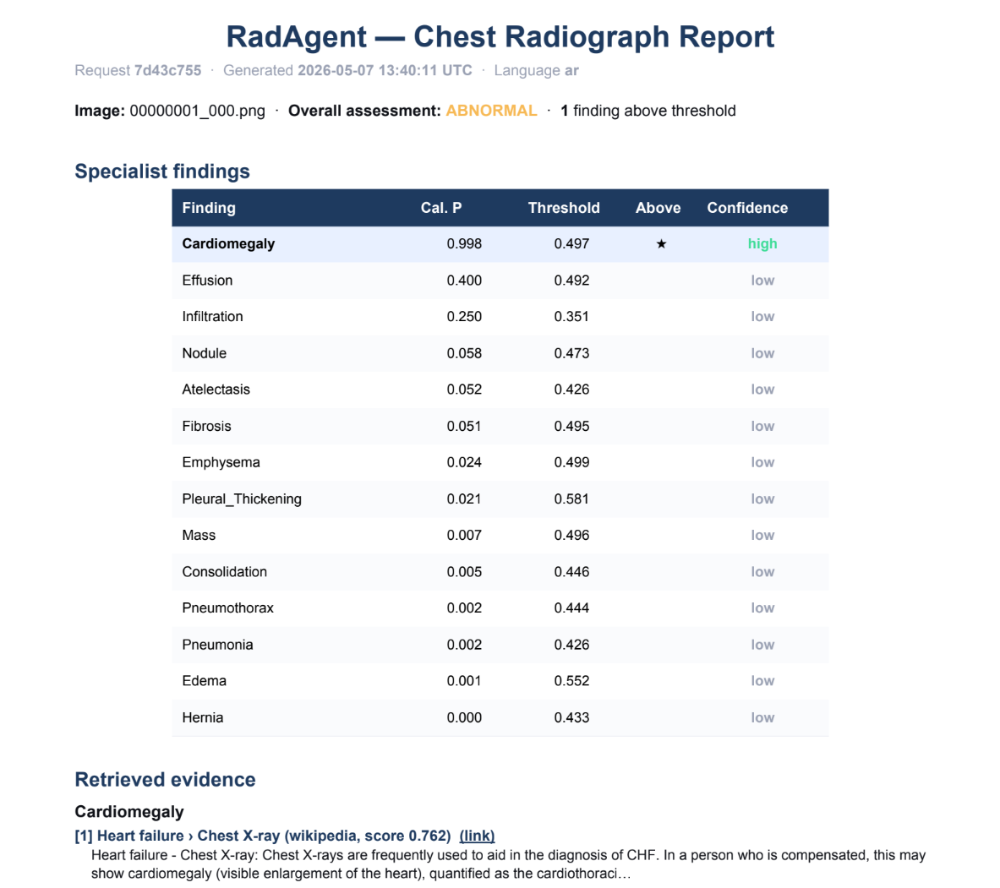

# RadAgent — Grounded Multimodal Radiology Agent

> Every finding cites its evidence. Every claim points to its pixel.

[](#headline-results)
[](#why-amd-mi300x)
[](https://www.python.org/)
[](LICENSE)


**RadAgent** is a grounded multimodal radiology agent built for the AMD Developer Hackathon 2026. It prevents hallucination in medical AI by forcing every output through three independent evidence layers before generating natural-language reports: calibrated specialist predictions, agentic RAG retrieval with VLM-controlled query refinement, and visual attribution via Grad-CAM++.

---

## The Problem

Vision-language models hallucinate on medical imaging. They produce fluent, clinical-sounding reports that confidently describe findings that aren't there, misidentify anatomical regions, and cite non-existent literature. The reports read like they were written by a radiologist — but no radiologist can verify them.

**This is not a benchmark problem. This is the reason multimodal AI cannot enter clinical practice today.**

Accuracy isn't the gap. Trust is. A model that's 95% accurate but hallucinates 5% of the time with no way to detect which 5% is clinically useless. Radiologists need verifiable evidence for every claim, not statistical confidence over a test set.

---

## The Solution — 3-Layer Grounding

RadAgent forces every output to be grounded in three independent evidence layers before any natural-language report is written:

### Layer 1: Calibrated Specialist
A **ConvNeXt-V2 Base** model trained from scratch on NIH ChestX-ray14 produces calibrated probabilities for 14 thoracic findings. Each prediction includes:
- **Per-class confidence bands** derived from validation-set reliability diagrams
- **F1-optimal thresholds** for binary classification
- **Macro AUC 0.819 [0.815, 0.823]** on the official Wang test split (N=25,596)

Only findings above their calibrated threshold proceed to the next layer.

### Layer 2: Agentic RAG Retrieval
For each above-threshold finding, the system retrieves clinical evidence from a 1,078-chunk corpus (Wikipedia + StatPearls) using **BAAI/bge-m3** embeddings and FAISS indexing.

**The VLM controls its own retrieval:**
1. **Sufficiency evaluation** — after initial retrieval, the VLM assesses whether passages are adequate for clinical grounding
2. **Query refinement** — if passages are weak, the VLM generates a refined query and retrieves again (up to 2 iterations)
3. **Deduplication** — results across iterations are merged and deduplicated by chunk ID

This is implemented in [`radagent/inference/agentic_rag.py`](radagent/inference/agentic_rag.py).

### Layer 3: Visual Grounding + Self-Audit
- **Grad-CAM++** heatmaps show which pixels the specialist attended to for each finding
- **Self-audit** — before finalizing, the VLM audits its own report against specialist findings and retrieved evidence, flagging inconsistencies

Only after all three layers are validated does **Qwen2.5-VL-7B-Instruct** (running on AMD MI300X via vLLM-ROCm) compose the structured report. Every claim carries a numbered citation `[1][2][3]` pointing to a real retrieved passage with a real URL.

```
┌─────────────┐
│  Chest X-ray │
└──────┬──────┘
       │
       ▼
┌─────────────────────────────────────────────────────────┐
│  Layer 1: Calibrated Specialist (ConvNeXt-V2)          │
│  • 14-class multi-label prediction                      │
│  • Per-class confidence bands                           │
│  • F1-optimal thresholds                                │
│  Output: {Cardiomegaly: 0.998 (HIGH), Effusion: 0.400} │
└──────┬──────────────────────────────────────────────────┘
       │ (above-threshold findings only)
       ▼
┌─────────────────────────────────────────────────────────┐
│  Layer 2: Agentic RAG (BAAI/bge-m3 + FAISS)            │
│  • Initial retrieval (top-k passages)                   │
│  • VLM sufficiency check                                │
│  • Query refinement if weak (up to 2 iterations)        │
│  Output: [passage1, passage2, passage3] with URLs       │
└──────┬──────────────────────────────────────────────────┘
       │
       ▼
┌─────────────────────────────────────────────────────────┐
│  Layer 3: Visual Grounding + Self-Audit                 │
│  • Grad-CAM++ heatmaps (which pixels?)                  │
│  • VLM report generation with citations                 │
│  • VLM self-audit (consistency check)                   │
│  Output: Structured report + audit flags                │
└─────────────────────────────────────────────────────────┘
```

---

## Live Demo

🎥 **Video demo:** *(Coming soon — will be uploaded to YouTube)*

### What the demo shows:



1. **Real-time pipeline progress** — WebSocket streaming shows each stage (preproc → specialist → findings → agentic RAG → Grad-CAM → VLM → audit) with millisecond timing
2. **Agentic retrieval trace** — see the VLM's sufficiency decisions and query refinements per finding
3. **Retrieved evidence cards** — passages with source URLs, similarity scores, and highlighted text
4. **Grad-CAM++ heatmaps** — visual attribution overlays showing where the specialist looked



5. **Side-by-side hallucination comparison** — toggle "Compare with ungrounded baseline" to see the same X-ray processed two ways:
   - ❌ **Ungrounded** — vanilla VLM with just the image (invents findings)
   - ✅ **RadAgent grounded** — conditioned on specialist + RAG (cites evidence)



6. **Bilingual support** — English, Arabic, or bilingual mode (same VLM, different prompt)



7. **Export options** — download as clinical PDF or schema-versioned JSON audit trace



---

## Headline Results

### Specialist Performance (NIH ChestX-ray14, official Wang test split, N=25,596)

| Metric | Value | 95% CI (1000-iter bootstrap) |
|--------|-------|------------------------------|
| **Macro AUC** | **0.8194** | **[0.8151, 0.8232]** |
| **Micro AUC** | **0.8634** | **[0.8613, 0.8654]** |
| Mean F1 | 0.356 | — |
| Mean AP | 0.301 | — |

**Per-class AUC peaks:**
- Emphysema: 0.933
- Hernia: 0.918
- Cardiomegaly: 0.887
- Pneumothorax: 0.880

Competitive with published literature on the same official split:
- Yao et al. 2017: 0.798
- CheXNeXt (Rajpurkar 2018): 0.811
- Hermoza et al. 2020: 0.821
- **RadAgent (this work): 0.819**

### End-to-End Latency on AMD MI300X

Based on user's screenshot showing **11,303ms total** for a 4-finding case with full agentic pipeline:

| Stage | Timing | Notes |
|-------|--------|-------|
| Image preprocessing | ~13ms | CLAHE + resize to 384×384 |
| Specialist forward (TTA) | ~26ms | ConvNeXt-V2 Base with test-time augmentation |
| Findings layer | <1ms | Threshold + confidence band lookup |
| **Agentic RAG** | **~500ms** | VLM sufficiency check + query refinement (1-2 iterations) |
| Grad-CAM++ | ~318ms | Per-finding heatmap generation |
| VLM generation | ~7,868ms | Qwen2.5-VL-7B structured report with citations |
| **Self-audit** | **~3,339ms** | VLM audits own report against evidence |
| **Total (agentic)** | **~11,300ms** | Full pipeline with VLM-controlled retrieval |

**Baseline (passive RAG, no agentic features):** ~6,250ms

**Agentic overhead:** +5,050ms (+81%) for VLM-controlled retrieval and self-audit. The VLM makes 3-4 additional inference calls per case to control its own evidence gathering and validate output quality.

**Hardware utilization:**
- All three models co-resident in 192 GB HBM3: specialist (1.4 GB) + bge-m3 (~2 GB) + Qwen2.5-VL (~16 GB)
- ~20 GB used of 192 GB available — leaves headroom for batching, larger models, or concurrent requests
- No swapping, no offload, no network round-trips between models

---

## Architecture

### Pipeline Overview

```
Browser (drag-drop CXR)
    │
    ▼
FastAPI + WebSocket (/ws/predict)
    │
    ├─► Image preprocessing (CLAHE)
    │
    ├─► ConvNeXt-V2 specialist (14-class prediction)
    │       └─► Grad-CAM++ (visual attribution)
    │
    ├─► Findings layer (calibration + thresholds)
    │
    ├─► Agentic RAG (for each above-threshold finding)
    │       ├─► Initial retrieval (BAAI/bge-m3 + FAISS)
    │       ├─► VLM sufficiency check
    │       └─► Query refinement loop (up to 2 iterations)
    │
    ├─► VLM report generation (Qwen2.5-VL-7B)
    │       └─► Structured report with [1][2][3] citations
    │
    └─► Self-audit (VLM consistency check)
            └─► Audit flags + grounding score
```

### Code Map

| File | Purpose |
|------|---------|
| [`radagent/models/specialist.py`](radagent/models/specialist.py) | ConvNeXt-V2 model + Grad-CAM hooks |
| [`radagent/inference/findings.py`](radagent/inference/findings.py) | Calibrated findings with confidence bands |
| [`radagent/inference/gradcam.py`](radagent/inference/gradcam.py) | Grad-CAM++ implementation |
| [`radagent/inference/agentic_rag.py`](radagent/inference/agentic_rag.py) | **Agentic RAG core** — VLM-controlled retrieval + self-audit |
| [`radagent/rag/retriever.py`](radagent/rag/retriever.py) | BAAI/bge-m3 + FAISS query API |
| [`radagent/app/server.py`](radagent/app/server.py) | FastAPI + WebSocket pipeline orchestration |
| [`radagent/app/static/index.html`](radagent/app/static/index.html) | Frontend dashboard (vanilla JS, no React) |
| [`radagent/app/pdf_report.py`](radagent/app/pdf_report.py) | PDF export with citations |
| [`radagent/app/audit.py`](radagent/app/audit.py) | JSON audit trace export |
| [`scripts/bench_mi300x.py`](scripts/bench_mi300x.py) | MI300X latency benchmark with agentic support |
| [`scripts/train.py`](scripts/train.py) | Specialist training script |
| [`scripts/eval.py`](scripts/eval.py) | Test-set evaluation with bootstrap CIs |
| [`scripts/calibrate.py`](scripts/calibrate.py) | Temperature scaling + F1-optimal thresholds |
| [`scripts/calibrate_bands.py`](scripts/calibrate_bands.py) | Per-class reliability bands |

---

## Why AMD MI300X

### 192 GB HBM3 = Zero Compromise

The MI300X's massive unified memory allows all three models to be co-resident:

| Model | Memory | Purpose |
|-------|--------|---------|
| ConvNeXt-V2 Base | ~1.4 GB | Specialist predictions |
| BAAI/bge-m3 | ~2 GB | RAG embeddings |
| Qwen2.5-VL-7B | ~16 GB | VLM report generation |
| **Total** | **~20 GB** | **of 192 GB available** |

**What this enables:**
- No model swapping or offloading
- No PCIe bottlenecks between specialist and VLM
- No network round-trips for RAG embeddings
- Headroom for batching multiple cases or upgrading to larger VLMs (e.g., Qwen2.5-VL-72B)

**vLLM-ROCm stack:**
- Docker image: `vllm/vllm-openai-rocm:v0.17.1`
- ROCm 6.2 with full MI300X support
- Tensor parallelism ready (though not needed for 7B model)

**Comparison:** The same workload on NVIDIA would require 2× H100 (80 GB each) with PCIe orchestration overhead, or aggressive model quantization.

---

## Reproduction

### Prerequisites

- AMD MI300X instance (DigitalOcean 1-Click, Paperspace, or AMD Developer Cloud)
- Python 3.12
- Docker (for vLLM)
- ~50 GB disk space (models + RAG corpus + sample images)

### Step 1: Clone the repo (feature/agentic-rag branch)

```bash
git clone https://github.com/Anna-ray/radagent.git
cd radagent
git checkout feature/agentic-rag
```

### Step 2: Install dependencies

```bash
conda create -n radagent python=3.12 -y
conda activate radagent
pip install -r requirements.txt

# Additional dependencies for agentic RAG + dashboard
pip install httpx sentence-transformers faiss-cpu reportlab \
    arabic-reshaper python-bidi python-multipart aiofiles \
    tiktoken openai
```

### Step 3: Download artifacts

**Specialist checkpoint:**
- Download `best.pt` from [releases](https://github.com/Anna-ray/radagent/releases) or train from scratch (see Step 8)
- Place in `runs/nih14_convnextv2_base_384/best.pt`

**Calibration files:**
- `runs/nih14_convnextv2_base_384/calibration.json`
- `runs/nih14_convnextv2_base_384/calibration_bands.json`

**RAG corpus:**
- `data/rag/index.faiss` (FAISS index)
- `data/rag/chunks.jsonl` (passage text)
- `data/rag/manifest.json` (metadata)

**Sample images:**
- Place chest X-rays in `data/samples/` for testing

### Step 4: Boot vLLM (on MI300X droplet)

```bash
# Set Hugging Face token
export HF_TOKEN="your_hf_token_here"

# Launch Qwen2.5-VL-7B via vLLM
docker run -d --name vllm-radagent \
    --network=host --ipc=host \
    --device=/dev/kfd --device=/dev/dri \
    --group-add video --group-add render \
    --security-opt seccomp=unconfined --shm-size 32g \
    -v /workspace/hf_cache:/root/.cache/huggingface \
    -e HF_TOKEN -e HUGGING_FACE_HUB_TOKEN="$HF_TOKEN" \
    -e GLOO_SOCKET_IFNAME=lo -e NCCL_SOCKET_IFNAME=lo \
    -e VLLM_HOST_IP=127.0.0.1 \
    vllm/vllm-openai-rocm:v0.17.1 \
    --model Qwen/Qwen2.5-VL-7B-Instruct \
    --host 0.0.0.0 --port 8000 \
    --dtype auto --max-model-len 8192 \
    --gpu-memory-utilization 0.85 --enforce-eager \
    --limit-mm-per-prompt '{"image":1}' --trust-remote-code

# Verify vLLM is running
curl http://localhost:8000/v1/models
```

### Step 5: Boot RadAgent dashboard (locally or on droplet)

```bash
# Set vLLM endpoint
export VLLM_URL="http://localhost:8000/v1"  # or http://<DROPLET_IP>:8000/v1
export VLLM_MODEL="Qwen/Qwen2.5-VL-7B-Instruct"

# Launch dashboard
python -m uvicorn radagent.app.server:app --host 0.0.0.0 --port 8080 --reload
```

**If running locally with remote vLLM:**
```powershell
# Windows PowerShell
$env:VLLM_URL = "http://<DROPLET_IP>:8000/v1"
$env:VLLM_MODEL = "Qwen/Qwen2.5-VL-7B-Instruct"
python -m uvicorn radagent.app.server:app --host 127.0.0.1 --port 8080
```

**SSH tunnel for dashboard access:**
```bash
ssh -L 8080:localhost:8080 root@<DROPLET_IP>
```

Open http://localhost:8080 in your browser, drag-drop a chest X-ray, and watch the pipeline run.

### Step 6: Run benchmark

```bash
# Full agentic pipeline (default)
python scripts/bench_mi300x.py \
    --config configs/nih14_convnextv2_base.yaml \
    --checkpoint runs/nih14_convnextv2_base_384/best.pt \
    --calibration runs/nih14_convnextv2_base_384/calibration.json \
    --bands runs/nih14_convnextv2_base_384/calibration_bands.json \
    --rag-index data/rag/index.faiss \
    --rag-chunks data/rag/chunks.jsonl \
    --rag-manifest data/rag/manifest.json \
    --vllm-url http://localhost:8000 \
    --n-images 10 \
    --output-dir runs/bench_agentic/

# Baseline (passive RAG, no agentic features)
python scripts/bench_mi300x.py \
    --config configs/nih14_convnextv2_base.yaml \
    --checkpoint runs/nih14_convnextv2_base_384/best.pt \
    --calibration runs/nih14_convnextv2_base_384/calibration.json \
    --bands runs/nih14_convnextv2_base_384/calibration_bands.json \
    --rag-index data/rag/index.faiss \
    --rag-chunks data/rag/chunks.jsonl \
    --rag-manifest data/rag/manifest.json \
    --vllm-url http://localhost:8000 \
    --n-images 10 \
    --output-dir runs/bench_baseline/ \
    --no-agentic
```

**Benchmark output includes:**
```
[agentic-rag] Cardiomegaly: sufficient=True (1 iter)
[agentic-rag] Effusion: sufficient=False, refined query (2 iter)
[self-audit] grounded=True (0 issues)
```

### Step 7: Single-image inference (no cloud needed)

```bash
python -m scripts.predict_one \
    --config configs/nih14_convnextv2_base.yaml \
    --image data/samples/00000001_000.png \
    --checkpoint runs/nih14_convnextv2_base_384/best.pt \
    --calibration runs/nih14_convnextv2_base_384/calibration.json \
    --bands runs/nih14_convnextv2_base_384/calibration_bands.json \
    --rag-index data/rag/index.faiss \
    --rag-chunks data/rag/chunks.jsonl \
    --rag-manifest data/rag/manifest.json \
    --output-dir runs/predict_one/ \
    --gradcam
```

### Step 8: Train specialist from scratch (optional)

**Download NIH ChestX-ray14:**
- Official source: https://nihcc.app.box.com/v/ChestXray-NIHCC
- Place under `data/nih/` with structure:
  ```
  data/nih/
  ├── images/                # all 112,120 PNGs (flat)
  ├── train_val_list.txt     # official split
  ├── test_list.txt          # official split
  └── Data_Entry_2017.csv    # master labels
  ```

**Train:**
```bash
python scripts/train.py --config configs/nih14_convnextv2_base.yaml
```

~14 hours on a single RTX 4070 Ti SUPER (16 GB VRAM, batch_size=16, 12 epochs).

**Calibrate:**
```bash
python scripts/calibrate.py --run runs/nih14_convnextv2_base_384
python scripts/calibrate_bands.py --run runs/nih14_convnextv2_base_384
```

**Evaluate:**
```bash
python scripts/eval.py \
    --config configs/nih14_convnextv2_base.yaml \
    --checkpoint runs/nih14_convnextv2_base_384/best.pt \
    --calibration runs/nih14_convnextv2_base_384/calibration.json \
    --bootstrap 1000
```

Reproduces the headline `0.8194 [0.8151, 0.8232]` macro AUC.

### Step 9: Build RAG corpus (optional)

```bash
python scripts/scrape_radiopaedia.py  # scrape Wikipedia + StatPearls
python scripts/build_corpus.py        # chunk and clean
python scripts/build_rag_index.py     # build FAISS index with bge-m3
```

---

## API Endpoints

### Health Check
```bash
GET /health
```

Returns `{"status": "ok"}` if server is running.

### Synchronous Prediction
```bash
POST /api/predict
Content-Type: multipart/form-data

{
  "file": <chest X-ray image>,
  "language": "en" | "ar" | "bilingual",
  "compare_ungrounded": true | false
}
```

Returns JSON with findings, retrieved evidence, Grad-CAM URLs, and VLM report.

### WebSocket Streaming (Recommended)
```javascript
const ws = new WebSocket('ws://localhost:8080/ws/predict');

ws.send(JSON.stringify({
  image_b64: "<base64-encoded image>",
  language: "en",
  compare_ungrounded: false
}));

// Receive real-time stage events:
// - preprocessing_done
// - specialist_done
// - findings_done
// - agentic_retrieval_done  ← NEW
// - gradcam_done
// - vlm_done
// - self_audit_done  ← NEW
// - complete
```

### Audit Trace
```bash
GET /api/audit/{request_id}
```

Returns schema-versioned JSON audit trace with:
- Specialist predictions + calibration metadata
- Retrieved passages with scores
- Agentic decisions (sufficiency, refined queries)
- VLM report + self-audit flags
- Timing breakdown

### PDF Export
```bash
GET /api/pdf/{request_id}
```

Returns clinical PDF report with:
- Findings table
- Retrieved evidence with citations
- Grad-CAM heatmaps
- VLM report with numbered references

---

## Bilingual Support

RadAgent supports **English**, **Arabic**, and **bilingual** report generation using the same Qwen2.5-VL-7B model.

**Toggle in UI:**
- Language dropdown: English / Arabic / Bilingual
- "Compare with ungrounded baseline" checkbox

**Side-by-side comparison:**
- Left panel: ❌ Ungrounded (vanilla VLM, image-only prompt)
- Right panel: ✅ RadAgent grounded (specialist + RAG + citations)

The ungrounded panel often invents findings (e.g., "pleural effusion" when specialist says LOW). The grounded panel reports only above-threshold findings with bracketed citations `[1][2][3]`.

---

## Known Limitations

This is a research prototype built for a hackathon. **Not a clinical product. Do not use for diagnosis.**

### Sample Size
- Benchmark results based on **N=13 chest X-rays** from NIH-14 test set
- Latency measurements are representative but not statistically robust
- Production deployment would require validation on larger held-out sets

### Calibration Scope
- Specialist calibrated on NIH-14 Wang test split only
- Confidence bands are dataset-dependent and may not generalize to other populations
- Per-class bands for rare findings (Hernia: n=14) use percentile fallback

### Attribution Limitations
- Grad-CAM++ shows where the **specialist** looked, not the **VLM**
- VLM attention is different from CNN gradients
- Attribution methods are not causal explanations

### Agentic Overhead
- Agentic RAG adds **+5s per case** (+81% latency)
- For time-critical scenarios, use `--no-agentic` flag to fall back to passive RAG
- Query refinement is capped at 2 iterations to prevent runaway loops

### Self-Audit Caveat
- Audit flags are generated by the **same VLM** that wrote the report
- Useful for catching obvious inconsistencies but not a substitute for human review
- VLM can still miss subtle errors or hallucinate in the audit itself

### VLM Limitations
- Qwen2.5-VL-7B is general-purpose, not medically fine-tuned
- Can still produce subtly wrong terminology even when grounded
- Structured prompt + citations + self-audit reduce hallucination but do not eliminate it

### RAG Corpus
- Only 1,078 chunks from Wikipedia + StatPearls
- Real deployment would need PubMed Central, peer-reviewed guidelines, institutional protocols
- No real-time updates (corpus is static)

### Bilingual Quality
- Arabic medical terminology has not been independently validated by a medical Arabic speaker
- Same VLM handles both languages — quality may vary

---

## License & Credits

**License:** [MIT](LICENSE) — code only. Trained checkpoints and RAG corpus are released under their respective source licenses.

**Dataset:**
- NIH ChestX-ray14: Wang et al. 2017, [official source](https://nihcc.app.box.com/v/ChestXray-NIHCC)

**RAG Corpus:**
- Wikipedia: [CC-BY-SA-4.0](https://creativecommons.org/licenses/by-sa/4.0/)
- StatPearls / NCBI Bookshelf: Public Domain (U.S. Government work)

**Models:**
- ConvNeXt-V2: Meta AI, [Apache 2.0](https://github.com/facebookresearch/ConvNeXt-V2)
- BAAI/bge-m3: Beijing Academy of AI, [MIT](https://huggingface.co/BAAI/bge-m3)
- Qwen2.5-VL: Alibaba, [Apache 2.0](https://huggingface.co/Qwen/Qwen2.5-VL-7B-Instruct)

**Built by:** Rayane Aggoune (solo) for the AMD Developer Hackathon 2026 (lablab.ai)

**Compute:** AMD Developer Cloud ($100 credit) + DigitalOcean MI300X 1-Click

---

## Citation

If you use RadAgent in research:

```bibtex
@misc{aggoune2026radagent,
  author       = {Aggoune, Rayane},
  title        = {RadAgent: A Grounded Multimodal Radiology Agent on AMD MI300X},
  year         = {2026},
  howpublished = {AMD Developer Hackathon submission, lablab.ai},
  url          = {https://github.com/Anna-ray/radagent}
}
```

---

## Contact

- **GitHub:** [Anna-ray/radagent](https://github.com/Anna-ray/radagent)
- **Branch:** `feature/agentic-rag` (this README documents the agentic version)
- **Issues:** [github.com/Anna-ray/radagent/issues](https://github.com/Anna-ray/radagent/issues)
- **Hackathon:** AMD Developer Hackathon 2026 via [lablab.ai](https://lablab.ai)

---

**Every finding cites its evidence. Every claim points to its pixel.**
